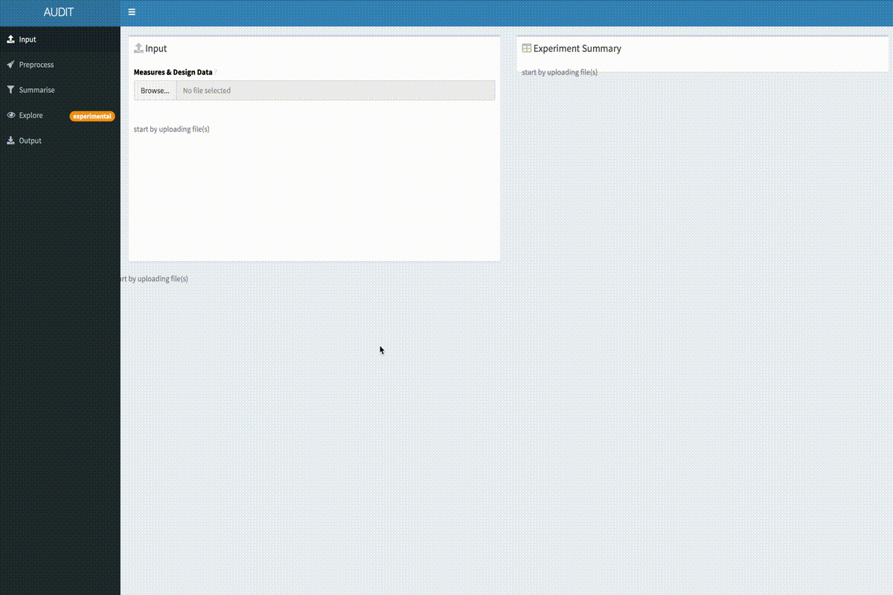

<!-- README.md is generated from README.Rmd. Please edit that file -->

# audit

<!-- badges: start -->

[](https://www.tidyverse.org/lifecycle/#experimental)
<!-- badges: end -->

An interactive application that ushers you through the inspection and
analysis of your growth curve experiments.

## Example



To start a new AUDIT session:

``` r
audit::run()
```

## Installation

Audit is currently only available on github and can be installed like
any other remote r package:

``` r
remotes::install_github("npjc/audit")
```

#### Step-by-step

1.  Install [R](https://cran.r-project.org) by downloading the
    appropriate package for your operating system from
    [cran](https://cran.r-project.org) and following the onscreen
    instructions.
2.  Install [Rstudio](https://www.rstudio.com/products/rstudio)
    (Optional), a development environment for R by downloading the
    appropriate image for your operating system from Rstudio’s [download
    page](https://www.rstudio.com/products/rstudio/download/#download)
    and follow the onscreen instructions.
3.  If this is a new R installation you will need to download some
    packages before being able to install audit. To do this, open R /
    Rstudio and enter the line below into the console. Follow the
    onscreen instructions.

<!-- end list -->

``` r
install.packages(c("devtools", "tidyverse", "remotes"))
```

4.  Install AUDIT and its dependencies by entering the line below into
    the console

<!-- end list -->

``` r
remotes::install_github("npjc/audit")
```

5.  To run AUDIT enter the line below at the console. This will open a
    new session in your default web browser.

<!-- end list -->

``` r
audit::run()
```

## More Info

### What is AUDIT?

AUDIT stands for **A**utomated **U**sher for **D**ata **I**nspection and
**T**idying (**AUDIT**). As in it helps you audit your growth curves.

AUDIT is really just an interactive interface to multiple modules. These
modules are also openly distributed as R packages:

  - [readcg12](https://github.com/npjc/readcg12)
  - [readgp1](https://github.com/npjc/readgp1)
  - [readyg](https://github.com/npjc/readyg)
  - [readbioscreen](https://github.com/npjc/readbioscreen)
  - [growr](https://github.com/npjc/growr)
  - [mtpview](https://github.com/npjc/mtpview) (and as a current
    workaround to known issue
    [mtpview1](https://github.com/npjc/mtpview1))

### If you find a bug

As you use AUDIT, if you find bugs, file an issue (ideally with a
reproducible example) at <https://github.com/npjc/audit/issues>. If you
are unsure how to make your example reproducible: provide input data
used and a description of the steps used or a link to a video
demonstrating it.

### Known Issue

The only change from previous communication is that mptview currently
exists as 2 separate packages (mptview and mtpivew1). This is a
temporary workaround for a bug in the underlying grid graphics system. I
will fold the mtpview1 back into the normal mtpview in the next R
release (grid is shipped with base R, more info).

### Experimental tag

The explore section is tagged as `experimental` as I will add new views
beyond what is already there. Once I have added all the views I will
remove the experimental tag.

### Absolutely No Guarantees

I have tried my very hardest to ensure that the software performs as
intended. I use the same underlying tools for my own work. I however
make absolutely no guarantees about the use and or results of AUDIT and
its associated software. I therefore encourage you to validate your
assumptions and check your work.
